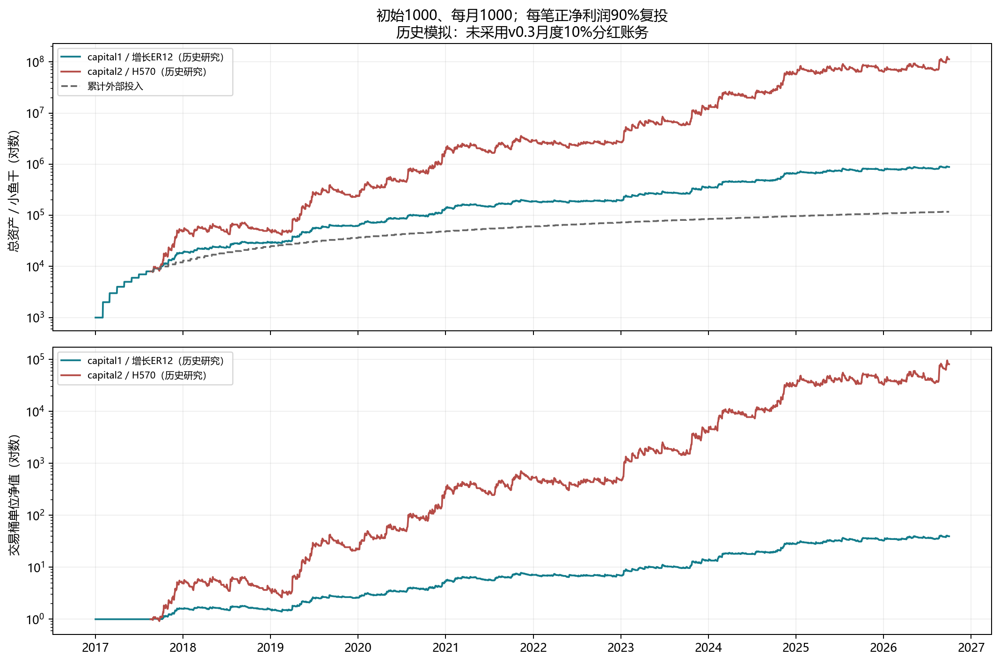
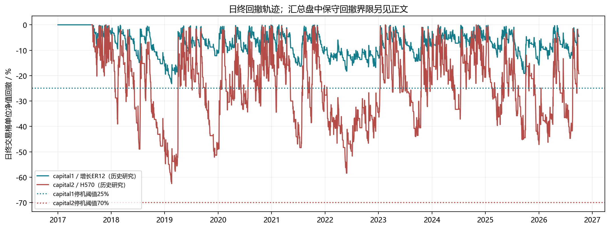
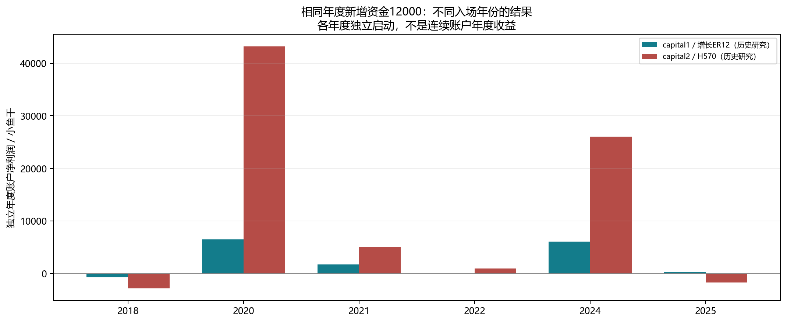
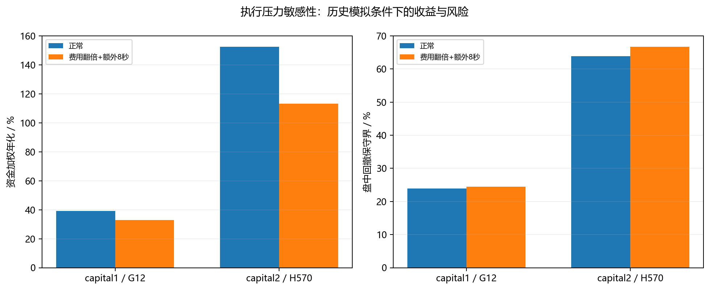

# INTRODUCTION.md · 两条基金的研究证据与冻结策略说明

面向**研究/评审读者**：两条基金（capital1 温和增长 · ER12 与 capital2 激进增长 · 5 倍）用的
是什么策略、冻结规则长什么样、历史研究给出了什么数字、这些数字能说明什么、**不能**说明什么。

- 产品与费用规则请看 [GUIDE.md](../usage/GUIDE.md)（投资人向）；部署与运维看 [DEPLOYMENT.md](../usage/DEPLOYMENT.md)；
  开发契约、测试与「改策略前必须先做什么」看 [USAGE.md](../usage/USAGE.md)。
- 下文 `research/` 表示仓库的 `docs/materials/research/`，`assets/` 表示 `docs/materials/assets/`。
- 原始数字与图表来源说明在 [research/](../materials/research/)，配图在 `assets/`。
- 本文所有金额、比率、回撤、交易数**全部照抄自** `research/evidence.json` 与
  `research/annual_comparison.json`，没有二次推算，也没有新的回测。

> **一句话前提**：本文描述的是**既有的 4 秒历史研究证据**，不是 v0.3 月度分红基金的净值表现，
> 也不是收益承诺。历史模拟里的资金规则与 v0.3 产品规则**不同**，两者不能互相引用为业绩。

---

## 0. 阅读前三件事

1. **这是模拟环境里的模拟基金。** 资产单位是站内小鱼干，数据是 Binance 一秒聚合成的 4 秒
   OHLC，价格自 2017-08-18 起、历史终止于 2026-10-01（不含终点）。它不是真实资金产品。
   （下文表格中的金额与比率为了可读性显示到 2 位小数，JSON 保留完整精度；
   需要精确值时以 `research/evidence.json` 为准。）
2. **历史模拟的两条口径，正文会反复区分：**
   - **总资产（total_assets）**：交易桶 + 留存现金桶，含全部累计出资，规模数字被复利放大；
   - **交易桶单位净值（trading unit NAV）**：剔除外部出资流量后的每单位策略表现。
     只有后者才接近「策略赚不赚钱」的问题，前者还混着「投入了多少、滚了多久」。
3. **不要用「总资产 ÷ 初始出资」再开方去算年化。** 那不是任何东西的收益率：出资是**按月**
   进来的，中途规模不断变大，只有资金加权口径（XIRR）才有意义。正文只引用 JSON 里现成的
   `money_weighted_return_pct` 与 `unit_nav_cagr_pct`，不制造第三个数。

---

## 1. 两条基金与冻结参数

v0.3 的参数在 `src/raricy_capital/contracts.py` 的 `POLICIES` 里**冻结**，配置里改不动
（配置写了 `policies` 且与冻结值不一致会直接报 `policies_are_frozen`，见 USAGE.md §6）。
`POLICIES` 的键就是 `capital1` 与 `capital2`，没有别的运行标识。

| 项目 | capital1 温和增长 · ER12 | capital2 激进增长 · 5 倍 |
| --- | --- | --- |
| 研究代号 | G12（增长 3 倍 · ER12 小时） | H570（H5 回撤阈值 70%） |
| 杠杆 | 3 倍 | 5 倍 |
| 单笔目标风险／交易桶权益 | 1.25% | 5% |
| 开仓名义仓位上限／交易桶权益 | 2 倍 | 5 倍 |
| 日内亏损暂停线 | 1.5% | 5% |
| 交易桶单位净值永久停机线 | 25% | 70% |
| 亏损后 ER12 门 | 12 小时 | 无（`loss_gate_hours=0`） |
| 冷却 / 最长持仓 | 4 小时 / 14 天 | 4 小时 / 14 天 |

**「温和」只是两条基金之间的相对定位。** G12 用 3 倍杠杆，风险高于更早的 2 倍「温和原版」，
正常历史回撤已经贴到 25% 停机线附近。两条基金**都是 BTC 多头策略，相关性高**，同时持有
并不构成风险分散。

历史研究里另外几个档位标签（例如 G12 侧的 `growth_original`、`gentle_original`）是
**未入选**的研究计划记录字段（Plan），只保留作历史对照，**不在** `POLICIES` 里、不参与交易，
也不构成任何额外的运行信号，见 §8.3。

---

## 2. 四张历史图表

四张图均根据归档的 4 秒历史研究生成，数据列见 `research/evidence.json` 的 `daily_columns`
（`timestamp_ms / trading_bucket / retained_cash / contributions / trading_unit_nav /
close_drawdown_pct / total_assets / net_profit`）。图的横轴是研究区间，**不是**本基金的实际运行记录。
最后一列是 `net_profit`（= `total_assets − contributions`，即资产变动剔除新增出资后的部分），
**不是** halt 标记——`daily_columns` 里没有 `halted_flag`。

### 2.1 资产与单位净值轨迹

上图是**总资产**（对数轴，灰虚线为累计外部投入），下图是**交易桶单位净值**。两张子图看的是
两个不同的东西，混着读会得出错误结论：

- **总资产**把「投入」和「策略」混在一起：先按月加钱，再让利润在越来越大的本金上复利，
  所以曲线的斜率和阶梯都同时反映出资与收益。capital1 全区间累计出资 117000、期末总资产
  881133.8483；capital2 同样是 117000 的累计出资、期末总资产 112600490.5353。两条曲线的
  绝对高度差**主要来自规模复利**，不是「单位本金赚了 100 倍」。
- **交易桶单位净值**把外部出资（申购、赎回、分红、紧急费留存）的流量归一掉，只让净值随交易
  盈亏变动（实现见 `strategy.py` 的 `nav_units_after_flow`）。这才是可比的口径：
  capital1 正常情景 `unit_nav_cagr_pct = 45.8178%`，压力情景 39.5957%–42.6820%。

因此：**不要**用「总资产 ÷ 1000」再开方构造一个「年化」，也不要拿上面两条曲线的间距去反推
收益率——那既不是单位净值收益，也不是资金加权收益。

### 2.2 日终回撤与停机线

纵轴是**日终交易桶单位净值回撤**（越向下越深），两条水平虚线是各自 25% / 70% 的永久停机阈值，
图中仅保留日终观测点，回撤峰值基于4秒收盘序列；汇总表中的收盘最大回撤统计全部4秒观测。三点需要区分：

1. **这里画的是日终（收盘）口径**，`close_drawdown_pct`。真正的保守界是**盘中回撤上界**
   `intrabar_dd_bound_pct`，它比日终更深，数值见 §5 的表；capital1 正常 23.93%、组合压力
   24.49%；capital2 正常 63.82%、压力 66.71%。看图时不要用日终曲线去替代盘中上界。
2. **这是「交易桶」回撤，不是基金整体净值回撤。** 基金净资产还包含现金留存桶，且 v0.3 会
   按月分红、收 5% 申购费、留 10% 紧急费——这些历史研究都没有模拟（见 §7、§9）。
   历史交易桶回撤**不能**直接替代基金整体回撤。
3. **历史最深回撤贴线但从未触发停机**：全区间所有行的 `halt_time` 都是 `null`，
   `liquidations` 都是 0。capital1 组合压力下的盘中上界 24.4867% 距 25% 只剩约 **0.51 个百分点**；
   capital2 压力下 66.7139% 距 70% 约 **3.29 个百分点**。这是「历史没有停机」，不是「不会停机」。

### 2.3 年度独立档（不同入场年份）

**各年度独立启动**（`context = annual_fresh`）：每年 1 月 1 日投 1000、其后 11 个月每月 1000，
全年新增出资 12000，**每年重新起跑、账户不连续**。它回答的是「如果我在那一年入场，那一年会
怎么样」，**不是**连续账户的年度收益，也不是任何一年的基金净值收益。

图只画了**两条基金都有数据**的年份（2018 / 2020 / 2021 / 2022 / 2024 / 2025）。capital1 还有
2019、2023、2026 三个独立档，capital2 侧没有对应档位，所以没有画——**没有补齐、也没有推算**。
逐年数值见 §6 与 `research/annual_comparison.json`。

### 2.4 执行压力敏感性

左图是资金加权年化（XIRR），右图是盘中回撤保守上界，蓝柱正常、橙柱「费用翻倍 + 额外 8 秒」。
capital1 的 XIRR 从 39.05% 降到 32.81%、盘中回撤上界从 23.93% 升到 24.49%；capital2 的 XIRR
从 152.54% 降到 113.16%、盘中回撤上界从 63.82% 升到 66.71%。**收益对执行成本敏感，回撤对执行
成本同向恶化**——capital1 的恶化幅度尤其值得注意，因为它的熔断余量本来就只有半个百分点。

---

## 3. 指标口径速查

| 字段 | 含义 | 引用时的注意 |
| --- | --- | --- |
| `total_assets` | 交易桶 + 留存现金桶，含全部累计出资 | 规模数字，含复利与出资，不是收益率 |
| `trading_bucket` / `retained_cash` | 两个内部资金桶 | 历史留存桶是「每笔正净利润 10% 存入」，**不等于** v0.3 的月度 10% 分红 |
| `contributions` | 累计出资（初始 1000 + 116 次月投 1000） | 全区间 117000；年度独立档 12000 |
| `net_profit` | `total_assets − contributions` | **不含**外部出资；事件行里等于期末资产 − 期初资产 − 期内新增出资 |
| `trading_unit_nav` / `unit_nav_cagr_pct` | 剔除外部流量的交易桶单位净值及其 CAGR | **最接近策略本身**的收益口径 |
| `money_weighted_return_pct` | 资金加权年化（XIRR 口径） | 已考虑按月出资的时点，可跨情景比较 |
| `close_unit_nav_drawdown_pct` | 4秒收盘交易桶单位净值最大回撤 | 4秒收盘口径，比盘中上界浅 |
| `intrabar_unit_nav_drawdown_bound_pct` | 盘中保守回撤上界 | 引用「回撤上界」时应使用这一列 |
| `trades` / `win_rate_pct` / `profit_factor` | 已平仓交易数、胜率、盈亏比 | PF = 总盈利 ÷ 总亏损（绝对值） |
| `worst_30d_return_pct` | 最差 30 日滚动收益 | capital1 有，capital2 也有（见 §5） |
| `halt_time` / `liquidations` | 永久停机时点 / 强平次数 | 全区间全为 `null` / `0` |
| `net_profit`（日频列） | 日频 `daily_columns` 的**最后一列**（第八列）= `total_assets − contributions` | 资产变动剔除新增出资后的部分；**不是** halt 标记，`daily_columns` 里没有 `halted_flag` |

---

## 4. 冻结策略协议（实现细节）

规则本身是纯函数：`src/raricy_capital/strategy.py` 与 `src/raricy_capital/hourly_signals.py`，
两者都不做 I/O、不改调用方状态。`hourly_signals.py` 现在只保留闭环小时信号与结算公式
（`closed_signal`、`payout_units`），原研究模块里的试运行计划（`Plan` / `PLANS`）**没有**带过来；
运行时的闸门在 `src/raricy_capital/trader.py`。

### 4.1 数据与指标：小时信号 + 4 秒执行

- **信号用已收盘小时 K 线**（`hourly_signals.py` 的 `closed_signal`）：EMA96、ATR14、24 小时
  EMA 斜率、12 小时 ER。要求至少 206 根已收盘小时线，检查无缺口、OHLC 合法。
  - EMA96：前 96 根均值做种子，其后用 `2/97 × close + 95/97 × EMA`；
  - ATR14：前 14 根真实波幅均值做种子，其后 Wilder 平滑 `(13×ATR + TR)/14`；
  - `distance = 2 × ATR / close`（这是初始止损距离，也是仓位公式的分母）。
- **4 秒数据只用于执行与风险**（报价、止损比较、结算），**不产生信号**。
  这一点常被误读成「4 秒级高频策略」——它不是：交易节奏由**小时收盘**决定，
  且入场只允许在小时收盘后 **15 秒**内（`strategy.py` 的 `ENTRY_WINDOW_MS`），
  避免「中途登录去追一个已经过期的信号」。

### 4.2 入场、仓位、止损、冷却

- **入场条件**：收盘价 > EMA96 **且** EMA96 > 24 小时前的 EMA96（趋势向上）。
- **仓位公式**（`strategy.py` 的 `entry_quantity_units`）：
  `q = min(cap, risk / (distance + fee × (1 − distance)))`，再取
  `stake = ⌊q × 可用交易现金 / leverage⌋`，低于站点最小份额则不开仓。
  这里 **`q` 是「名义仓位／交易桶权益」的比例**，`stake` 是保证金意义上的投入。
- **止损**：`stop_price = entry × (1 − distance)`，即固定的 2ATR 止损。
- **最多一个仓位**，不加仓、不补仓；被平掉后需重新满足入场条件。
- **冷却**（`strategy.py` 的 `cooldown_ready`）：退出后等「下一个整点」，**再**冷却 4 小时；
  叠加 15 秒新鲜度窗口，实际最早重新入场落在退出那一刻之后 4–5 小时的那个小时边界上。
  **强平同样启动冷却**（任何一次卖出都会写入 `exit_signal_ms`）。

### 4.3 名义仓位上限 vs 风险预算 vs 杠杆

三个数容易被当成同一件事，实际是三层：

| 概念 | capital1 | capital2 | 含义 |
| --- | --- | --- | --- |
| `leverage` | 3 | 5 | 把 `stake` 放大成**名义仓位**的倍数：名义 = stake × leverage |
| `risk` | 1.25% | 5% | **单笔预算亏损**：止损被打到时的目标亏损／交易桶权益 |
| `cap` | 2 倍 | 5 倍 | **单笔名义仓位上限**／交易桶权益 |

所以「3 倍／5 倍杠杆」**不是**「权益被放大 3 倍／5 倍持续暴露」。实际的平均名义仓位／权益为：

- capital1：正常 **0.3061**、组合压力 **0.3022**；
- capital2：正常 **1.1272**、压力 **1.1160**。

波动越大的时段 `distance` 越大，`q` 越小，名义仓位自动收缩——这是这套仓位公式的波动自适应效果，
也是为什么长期平均暴露远低于表内上限。反过来，**当 `distance` 很小（低波动）时 `cap` 会成为约束**，
此时单笔预算亏损可能**小于** `risk` 标称值，因为名义被上限截住了。

### 4.4 日内暂停与永久停机

- **日切用北京时**（`strategy.py` 的 `beijing_day`，与 H570 研究计划里 `day_offset = 8`
  一致）。跨日时记录当日起始净值并解除暂停。
- **日内暂停**：交易桶单位净值相对当日起始值跌幅达到 **1.5%（capital1）/ 5%（capital2）** 时，
  安排退出持仓并在**当日**暂停新开仓，下一交易日恢复。
- **永久停机**：`1 − NAV/峰值 ≥ 25%（capital1）/ 70%（capital2）` 时进入永久停机
  （`trader.py` 的停机闸门）。停机后只做估值与对账、不再开仓；
  **追加本金不解除停机**：`trader.py` 的 `set_running(True)` 在停机状态下直接抛
  `permanent_halt`。
- **峰值只升不降**，且**外部资金流不改变净值**（见 §4.5），所以「加钱」既不能抬高净值、
  也不能替基金回到停机线之上。

### 4.5 ER12 亏损门（capital1）与 H570 的无门

`strategy.py` 的 `loss_gate_allows`：

- **触发条件**：上一笔已平仓交易是亏损（`pnl < 0`，`trader.py` 写入 `last_loss`）。
- **窗口**：从该笔**结算时刻**起 12 小时内。
- **要求**：同时满足 **ER12 ≥ 0.30** 且**过去 12 小时净价格变化 > 0**。
- **到期后**：12 小时一过，这条额外限制自动失效，其他趋势与风险条件仍然适用。
- **ER12 定义**：`ER12 = |收盘 − 12 小时前收盘| ÷ Σ|逐小时变化|`（`hourly_signals.py` 的
  `closed_signal`），取值 0–1，越高表示趋势越连贯。它的作用是「亏完之后，只在行情重新走出干净方向时才允许回头」，
  避免在震荡里连续挨打。

**capital2（H570）没有这道门**：`FundPolicy.loss_gate_hours` 默认 0，`loss_gate_allows` 立即返回
`True`。研究计划记录里的 `gate` 字段也是 `baseline`。所以 H570 亏损后只有 4 小时冷却，
没有额外的 ER12 条件。

### 4.6 运行时闸门与资金流归一

- **资金流归一**（`strategy.py` 的 `nav_units_after_flow`、`trader.py` 的资金流落地路径）：申购、赎回、月度分红、紧急费留存
  等**外部流量**会把交易桶「单位数」按 `equity / (equity − flow)` 缩放，使净值只随交易盈亏变动；
  交易盈亏本身**不是**流量，不会被归一。**新增存款因此不能改变净值、峰值或回撤基线，也就不能
  解除停机。**
- **账户闸门**：每 4 秒一个 tick，最多每分钟对账一次权威快照；发现非自有仓位只隔离
  （`untracked_positions`）不平仓；费率或杠杆可用性与冻结值不一致时置 `blocked` 并停止开仓。
- **订单安全**：意图先落盘再发请求；未知结果的买入不重放（超 20 秒转 `unconfirmed_buy` 等对账）；
  卖出按仓位 ID 幂等重放。`live=False`（默认）下**不产生任何外部写**。
- 新建状态以 `stopped` 起步，需操作方显式 `set_running` 才可能开仓。

### 4.7 为什么胜率只有 26%

这套系统是**趋势跟随**：**亏损单被迅速砍掉，盈利单被允许跑。**

- 亏损单的离场路径很短——跌破 2ATR 止损（`atr_stop`）或小时趋势失效（`trend`）即出，
  单笔亏损被 1.25% / 5% 的风险预算限制住；
- 盈利单**没有止盈、没有移动止盈、没有分批减仓**，只有在趋势失效、持仓满 14 天或停机时才会离场。

所以「26% 胜率」不是缺陷，而是这类策略的固有形态。capital1 正常情景的 1015 笔交易里
约 271 笔盈利、744 笔亏损：**平均每笔盈利 ≈ 7862，平均每笔亏损 ≈ 1837，赢亏比约 4.3 倍**
（JSON 里的总盈利 2130680.86 / 总亏损 1366547.02），PF 1.5592。
只看胜率会得出与 PF 完全相反的评价。capital1 的 ER12 门进一步压低了「亏完之后立刻回头
再亏一次」的概率；H570 没有这道门，正常情景 PF 1.3742、`daily_pauses = 550`
（capital1 侧未单列 `daily_pauses`，两者不能直接比较暂停次数）。
逐项数字见 [historical_evidence.md](../materials/research/historical_evidence.md) §5。

---

## 5. 策略有效性：正常 vs 组合压力

两条基金的「正常」与「组合压力」来自同一批历史研究，但**情景命名不完全对称**：

- capital1（G12）有四个情景行：`normal`、`fee_double`、`delay8`、`combined`；
- capital2（H570）只有两行：`normal` 与 `stress`（图表标签为「费用翻倍 + 额外 8 秒」，与
  capital1 的 `combined` 是同一种组合压力）。

**全区间（2017-08-18 至 2026-10-01，不含终点；累计出资 117000）**

| 基金 / 情景 | 总资产 | 净利润 | XIRR | 累计出资 | 留存现金 | 4秒收盘回撤 | 盘中回撤上界 | 交易数 | 胜率 | PF | 最差 30 日 | 永久停机 | 强平 |
| --- | ---: | ---: | ---: | ---: | ---: | ---: | ---: | ---: | ---: | ---: | ---: | --- | ---: |
| capital1 / 正常 | 881133.85 | 764133.85 | 39.05% | 117000 | 213068.07 | 23.53% | **23.93%** | 1015 | 26.70% | 1.5592 | −10.56% | 无 | 0 |
| capital1 / 费用翻倍 | 755542.52 | 638542.52 | 36.07% | 117000 | 184452.41 | 24.33% | 24.34% | 1013 | 26.16% | 1.5295 | −10.67% | 无 | 0 |
| capital1 / 延迟 8 秒 | 735571.91 | 618571.91 | 35.56% | 117000 | 185451.95 | 23.56% | 24.21% | 1007 | 26.32% | 1.5005 | −11.60% | 无 | 0 |
| **capital1 / 组合压力** | 637623.51 | 520623.51 | 32.81% | 117000 | 162838.19 | 23.85% | **24.49%** | 1005 | 25.77% | 1.4700 | −11.81% | 无 | 0 |
| capital2 / 正常 | 112600490.54 | 112483490.54 | 152.54% | 117000 | 41307763.59 | 63.80% | **63.82%** | 1100 | 26.82% | 1.3742 | −35.10% | 无 | 0 |
| **capital2 / 组合压力** | 26193229.19 | 26076229.19 | 113.16% | 117000 | 11516328.01 | 66.70% | **66.71%** | 1109 | 26.06% | 1.2927 | −35.75% | 无 | 0 |

（金额单位：小鱼干。加粗的回撤列为 §2.2 所说的「盘中保守上界」，也是计划草案与 GUIDE 引用的那一列。）

**辅助列（同一批情景）**

| 基金 / 情景 | 单位净值 CAGR | 持仓时间占比 | 平均名义仓位／权益 | 手续费 | 日暂停次数（本行情景） |
| --- | ---: | ---: | ---: | ---: | ---: |
| capital1 / 正常 | 45.82% | 37.03% | 0.3061 | 48270.16 | 未单列 |
| capital1 / 组合压力 | 39.60% | 37.06% | 0.3022 | 73350.58 | 未单列 |
| capital2 / 正常 | 未单列 | 38.16% | 1.1272 | 11334957.09 | 550 |
| capital2 / 组合压力 | 未单列 | 38.14% | 1.1160 | 6368129.20 | 561 |

读表要点：

1. **停机线不是「损失上限」。** capital1 正常 23.93%、压力 24.49%，与 25% 停机阈值只差
   1.07 / 0.51 个百分点；capital2 63.82% / 66.71% 与 70% 差 6.18 / 3.29 个百分点。
   历史**没有**触发停机，但跳价、报价中断、退出延迟、资金费率、借贷利息、滑点都可能
   让实际回撤越过阈值——**25% / 70% 是紧贴历史观测最深水位的停机阈值，不是保证的封顶**。
2. **capital1 的单位净值 CAGR 与 XIRR 不是一回事。** 45.82% 是剔除流量的净值口径，
   39.05% 是资金加权口径；压力下分别降到 39.60% 与 32.81%。引用时必须说清用的是哪一个。
3. **capital2 的绝对金额大得多，但风险也大得多**：最差 30 日 −35.10%（正常）／−35.75%（压力），
   是 capital1 的三倍以上；同期回撤 63.82% / 66.71% 也远高于 capital1。
4. **capital1 的 `unit_nav_cagr_pct` 与 `money_weighted_return_pct` capital2 侧没有同名字段**
   （只有 XIRR），不要为了对称而自行补算。

---

## 6. 牛市、熊市与亏损年份

### 6.1 年度独立档（各年重新起跑，每年出资 12000）

| 年份 | capital1 净利润 | capital1 XIRR | capital1 PF | capital1 回撤（日终/盘中） | capital2 净利润 | capital2 XIRR | capital2 PF | capital2 回撤（日终/盘中） |
| --- | ---: | ---: | ---: | ---: | ---: | ---: | ---: | ---: |
| 2018 | **−713.21** | −10.75% | 0.8290 | 16.28% / 16.75% | **−2791.64** | −39.75% | 0.8160 | 50.42% / 50.45% |
| 2020 | +6472.68 | +111.77% | 2.1816 | 12.00% / 12.07% | +43174.19 | +990.21% | 2.2795 | 34.29% / 34.34% |
| 2021 | +1707.35 | +27.17% | 1.3973 | 16.51% / 16.55% | +5106.80 | +86.46% | 1.2699 | 47.82% / 47.92% |
| 2022 | +13.84 | +0.21% | 1.0035 | 14.64% / 14.80% | +961.56 | +15.07% | 1.0754 | 48.57% / 49.22% |
| 2024 | +6079.21 | +104.36% | 2.3235 | 9.38% / 9.38% | +26064.87 | +545.34% | 1.9525 | 37.43% / 37.50% |
| 2025 | +333.70 | +5.16% | 1.0658 | 19.58% / 19.61% | **−1659.05** | −24.40% | 0.9100 | 49.64% / 49.72% |

capital1 另有三个独立档（**capital2 侧没有对应档位，因此未配对**）：

| 年份 | capital1 净利润 | XIRR | PF | 交易数 | 回撤（日终/盘中） |
| --- | ---: | ---: | ---: | ---: | ---: |
| 2019 | +3476.43 | +57.24% | 1.8044 | 105 | 12.66% / 12.75% |
| 2023 | +4306.99 | +71.95% | 1.7437 | 112 | 15.14% / 15.18% |
| 2026（至 10-01，出资 9000） | +970.99 | +27.45% | 1.3951 | 84 | 13.84% / 13.85% |

**读出来的牛熊结论：**

- **2018 年是唯一一条两条基金都亏的年份**：capital1 −713（PF 0.83），capital2 −2791.64（PF 0.82，
  回撤 50.45%）。那一年 BTC 全区间 −71.60%，趋势策略在单边下跌里被反复止损。
- **2022 年是「没亏但也几乎没赚」的年份**：capital1 只有 +13.84、PF 1.0035，接近打平；
  capital2 反而 +961.56，但回撤 49.22%。同期 BTC −65.44%。
- **2025 年分化**：capital1 小赚 +333.70（PF 1.0658，回撤 19.61%，是它最深的年度回撤之一），
  capital2 亏 −1659.05（PF 0.9100，回撤 49.72%）。同期 BTC −7.82%。
- **牛市年份两条基金都强**：2020（BTC +299.81%）capital1 XIRR +111.77% / capital2 +990.21%；
  2024（BTC +124.73%）capital1 +104.36% / capital2 +545.34%。
- **BTC 涨跌不能直接预测基金盈亏**：2023 年 BTC +155.92%，capital1 XIRR +71.95%；
  而 2025 年 BTC −7.82%，capital1 仍是正的。两条基金都是**趋势跟随**，吃的是方向能否延续，
  不是当年涨跌幅。

### 6.2 连续账户的年度切片（仅 capital1 有）

capital1 的 `events` 里另有一组 `context = continuous` 的年度行，是**同一连续账户**在每年的切片
（期末资产与下一年期初资产首尾相接），与 §6.1 的独立档不是一回事：

| 年份 | 区间收益 | 净利润 | 回撤 | 同期 BTC |
| --- | ---: | ---: | ---: | ---: |
| 2018 | −3.82% | −1286.23 | 16.75% | −71.60% |
| 2019 | +69.91% | +21146.04 | 12.76% | +91.77% |
| 2020 | +107.85% | +61820.51 | 12.14% | +299.81% |
| 2021 | +32.44% | +38772.99 | 16.62% | +66.86% |
| 2022 | −2.52% | −3789.96 | 14.80% | −65.44% |
| 2023 | +92.13% | +140249.33 | 15.18% | +155.92% |
| 2024 | +109.60% | +291948.03 | 9.38% | +124.73% |
| 2025 | +16.12% | +86756.48 | 19.61% | −7.82% |
| 2026（至 10-01） | +21.39% | +122445.19 | 13.85% | −4.34% |

注意 `净利润` = 期末资产 − 期初资产 − 期内新增出资，**不含**当年新增出资 12000（2026 年 9000）。
它比 §6.1 的独立档大得多，是因为连续账户在切片时本金已经更大、复利更久，不是因为把出资算进了利润。
`区间收益` 一列才是剔除外部出资流量后的净值口径（流量归一由 `trading_unit_nav` 支撑），两列不可混用。

**不要把这些数字当成时间加权收益率**：`净利润` 的金额、以及「净利润 ÷ 累计出资」的比例都
混入了出资时点与规模复利。只有 `trading_unit_nav` 这类剔除流量的口径，才回答「策略本身赚不赚钱」。

### 6.3 事件研究：**只有 capital1 有**

capital1 提供 12 个事件窗口（`context = continuous`），**capital2 一个都没有**——H570 的证据里
没有对应的事件行，因此本文**不配对、不推算、不臆造** H570 的事件统计。

| 事件 | 窗口 | 收益 | 回撤 | 净利润 | 交易数 | 胜率 | 同期 BTC |
| --- | --- | ---: | ---: | ---: | ---: | ---: | ---: |
| 2018 年牛熊转换 | 2018-01→04 | +4.56% | 9.99% | +912.12 | 23 | 34.78% | −46.53% |
| 2018 年底下跌 | 2018-11→2019-01 | −6.31% | 8.57% | −1742.95 | 16 | 18.75% | −41.32% |
| 2019 年上涨后反转 | 2019-07→10 | +7.82% | 8.99% | +4096.38 | 21 | 23.81% | −25.80% |
| 2020 年 3 月冲击 | 2020-03-08→20 | −1.35% | 3.15% | −868.32 | 1 | 100% | −35.32% |
| 2021 年 5 月去杠杆 | 2021-05-10→25 | −1.25% | 1.86% | −1678.88 | 1 | 0% | −34.58% |
| 2021 年底至 2022 熊转 | 2021-11→2022-07 | −4.80% | 18.90% | −7449.48 | 66 | 21.21% | −68.34% |
| 2022 年 5 月冲击 | 2022-05-05→20 | −4.00% | 4.28% | −6120.60 | 4 | 0% | −22.02% |
| 2022 年 6 月冲击 | 2022-06-10→25 | −1.37% | 2.58% | −2108.57 | 3 | 0% | −31.08% |
| 2022 年 11 月 FTX | 2022-11-05→20 | −0.31% | 3.48% | −480.10 | 3 | 33.33% | −20.07% |
| 2023 年 8 月急跌 | 2023-08-16→23 | 0.00% | 0.00% | 0.00 | 0 | — | −11.58% |
| 2024 年 8 月急跌 | 2024-08-01→12 | +0.64% | 2.56% | +2530.43 | 0 | — | −9.42% |
| 2024 年二三季度震荡 | 2024-04→10 | +4.73% | 8.97% | +17777.80 | 47 | 31.91% | −9.69% |

其中 2023-08 与 2024-08 两个窗口**没有发生任何交易**（0 笔），是因为当时不满足入场条件、
或已有仓位在持有——这正是「不做信号之外的事」的体现。2020 年 3 月和 2021 年 5 月也只各有
1 笔交易。**「交易少」不是数据缺失，是策略在那些窗口里本来就空仓。**

---

## 7. 投资人经济：分红、基准 H 与利润池 R

历史研究**没有**模拟 v0.3 的资金规则。下面这套规则只存在于产品设计（[GUIDE.md](../usage/GUIDE.md) 与
[FUND_PLAN_V0.3.md](FUND_PLAN_V0.3.md)），**没有历史回测**：

- **月度窗口**：每月 1 日至 7 日 18:00（北京时，含）提交申购/普通赎回，窗口外拒绝新申请；7 日 18:00 为当月到账与撤回截止；
  次月 7 日 20:00 结算批次统一估值、分红登记、除息、赎回确认与份额发行；普通赎回确认后 5 个工作日内付款。
- **可分配利润**：`B = max(0, min(R, (N − H) × S))`，`分红 D = 10% × B`，`单位分红 d = D / S`，
  **除息净值 = N − d**。`N` 是结算批次分红前单位净值，`S` 是登记截点在外份额。
- **基准 H**：成立时 1.0000；**宣告分红后更新为除息净值**；普通不分红月份保持不变。
  紧急费留存这类**非交易**收入造成的净值抬升，会按每份额金额**向上调整 H**，
  避免把它误当成新的投资利润。
- **利润池 R**：累计净已实现投资利润，扣除已宣告分红与随赎回退出的对应部分，**允许为负**；
  紧急赎回费不计入 R。
- **恢复逻辑**：亏损之后的盈利月份不一定能分红——必须**同时**满足当月净利润为正、
  累计已实现利润为正、净值高于 H、现金留存桶足以支付、账目核平。
  计划草案的示例里第 2 月亏 −500、第 3 月赚 +300，`B` 仍然是 0，就是这条在起作用。
- **注销与新份额**：`R` 按退出份额占比调整；**同一批次按同一除息净值发行的新份额
  （外部申购与自动分红复投）不领取本次旧份额的分红**，自本批次确认后参与盈亏。
  已赎回份额对应的分红以**现金**支付，不参与复投，避免「先赎回又增加持仓」。
- **5% 申购费**：净本金之外的额外费用，归机构，**不进**基金净资产、利润池或份额。
  同基金自动分红复投免收；现金到账后重新申购、跨基金转入照收。紧急赎回费 10% 归**原基金**
  作流动性补偿，也不计入可分配利润。
- **月度分红方式选择**：每月 25 日 18:00 前提交或修改；之后提交的**从下月生效**，不追溯改写本月。

**关键提醒：历史数字里既没有这 5%，也没有分红负债和基金净值。** 历史模拟的资金规则是
「初始 1000、每月 1000、每笔已实现正净利润 90% 复投、10% 进留存现金、无利息」，
**这不是** v0.3 的「月度可分配利润 10% 分红」，二者不能互相代入。

出资时间表本身是**已知的**：2017-01-01 初始 1000，其后每月 1000，共 116 次月投，合计 117000。
行情自 2017-08-18 才开始，所以两条基金都先经过一段**现金持有期**；这段早期现金不产生交易，
不等于出资日期无法复原。

---

## 8. 局限、敏感性与不充分的替代证据

### 8.1 数据本身的局限（`evidence.json.limitations`）

1. **没有资金费率与借贷利息**；2. **正常情景没有买卖价差与滑点**；
3. 2017-08-18 行情开始前的现金持有期在展示口径上未单独成行（出资时间表本身已知，见 §7）；
4. 每笔盈利 90/10 拆分**不同于** v0.3 的月度可分配利润分红；
5. 巨大的模拟余额**不能证明**站点容量或未来盈利；
6. 研究档位的筛选**不是**未被触碰的未来验证。

另外几条本文补充的：

- 手续费口径是「退出时名义金额的 0.02%，一次收取」；压力情景把它翻倍到 0.04% 并加 8 秒延迟。
- capital2 的情景表**只有正常与一组组合压力**，没有单独的「仅费用翻倍」「仅延迟 8 秒」行；
  单因子归因只在 capital1 侧能做。
- capital1 的 `daily_pauses` 在 JSON 里未单列；capital2 有（正常 550、压力 561）。
- capital1 侧有 `negative_months`（正常 42/110 = 38.18%）、`worst_month_pct`（−9.77%）、
  `longest_underwater_days_active`（428 天）、`no_new_high_at_end = true`；
  **capital2 侧没有这些字段**，所以不能比较「月度亏损比例」或「最长水下时间」。

### 8.2 敏感性

- capital1 的三种压力都让 XIRR 下降（正常 39.05% → 费用翻倍 36.07% → 延迟 8 秒 35.56% →
  组合 32.81%），且**组合压力下盘中回撤上界升到 24.49%**，离 25% 停机线只剩半个百分点；
  PF 从 1.5592 降到 1.4700，胜率基本不变（26.70% → 25.77%）。
- capital2 的组合压力让 XIRR 从 152.54% 降到 113.16%、PF 从 1.3742 降到 1.2927、
  盘中回撤上界从 63.82% 升到 66.71%。
- **回撤对成本恶化的敏感度比收益更值得关注**：capital1 的收益下降约 6.2 个百分点，
  但熔断余量被吃掉一半以上。

### 8.3 已知的、未入选的历史档位不足以作为预期

仓库里保留的档位标签（`growth_original`、`gentle_original` 等）是历史研究包**计划记录**（Plan）里的
对照项，不是本包的运行注册表：`hourly_signals.py` 现在只带过来 `closed_signal` 与 `payout_units`，
原有试运行计划（`Plan` / `PLANS`）没有独立保留；当前包的策略注册表只有 `contracts.py` 的
`POLICIES`，键是 `capital1` 与 `capital2`。

- 这些未入选标签**不在** `POLICIES` 里，不参与交易；可选的历史字段即使被记录，也**不是**额外的实时信号。
- capital2 的研究计划记录（`evidence.json.capital2.plan`）显示它走的是 `family = single`、
  `model = base` 的**基础档**，
  一大票可选过滤器全部关闭（`adx_min=0`、`vol_filter=0`、`momentum_filter=0`、`volume_filter=0`、
  `flow_window=0`、`early_reentry=false`、`rebalance=0`、`protect_trigger/lock`、`trail_mode=0`）。
  也就是说：**被选中的是最朴素的版本，带过滤器的变体都没入选**。
- **结论**：任何未入选档位（含更早期、更短周期或带过滤器的变体）的历史表现，
  都**不构成**对本基金收益的合理预期；用它们做预期会高估。

### 8.4 研究候选 vs 已实现的冻结配置

| | 研究候选（保留但不用） | 已实现的冻结配置（`POLICIES`） |
| --- | --- | --- |
| 档位 | 历史研究计划记录里的 `growth_original`、`gentle_original` 等标签，以及 H570 记录里全部关闭的可选过滤开关 | `POLICIES` 的 `capital1`（G12 规则）与 `capital2`（H570 规则） |
| 作用 | 历史对照、说明「选择过程存在」 | 实际交易与风控的唯一规则 |
| 可引用性 | 不足以支撑任何收益预期 | 受 §8.1 / §8.2 / §9 的全部限制 |

**已实现的冻结配置 ≠ 已验证。** 目前**没有** Linux / Windows 服务部署、也没有真实账户在跑，
`POLICIES` 只是一份冻结的实现配置。参数的筛选反复使用过同一段历史数据，存在过拟合；本文所有数字都是
**同一段历史内的研究证据**，不是「没被触碰的样本外验证」，更不是未来收益的保证。

---

## 9. 顺序与歧义：引用前请先读这一节

**1. H570 统一引用最终研究数据。** `research/evidence.json.source_files` 指向
`btc_highrisk_funds_2026-10-03_final_r90`；正常情景净利润为112483490.5353，与计划草案附录一致。

**2. 历史研究没有跑过 v0.3 的基金级回测。** 没有按「月度可分配利润 10% 分红 + 份额台账 +
分红负债 + 5% 申购费 + 月度赎回 20% 上限 + 紧急赎回」重算过历史。因此：

- 没有任何「基金单位净值」历史序列可引用；
- 没有「分红后复利」的历史结果；
- 计划草案附录里那些大额数字（含 764133.85 与 112483490.54）是**策略研究口径**，
  包含历史留存桶，**不能**当作基金净值业绩、当期规模或未来收益。

**3. 不要把大额复合数字当作「现在的规模」或「未来的结果」。** 112600490.54 小鱼干是
「1000 起投、每月 1000、连续 9 年、在模拟环境里按上述规则运行」的模拟终值，
既不是本基金成立时的规模，也没有验证过在这么大名义仓位下的站点容量、成交与强平能力。

**4. 组合压力命名不对称。** capital1 的 `combined` 与 capital2 的 `stress` 都对应
「费用翻倍 + 额外 8 秒」，但 capital2 的行内没有重复标注费率与延迟字段；
交叉引用时请写明「按图表标签」。

**5. 年度档与连续档不能混用。** `annual_fresh` 是每年重新起跑；`continuous` 是同一账户切片。
H570 没有连续年度切片，G12 没有 2017 年的独立档（行情自 2017-08-18 起）。

**6. 2026 年是不完整年度。** 截至 2026-10-01（不含），因此 2026 年度的出资、交易数与收益
都不能与整年直接比较（capital1 独立档 2026 出资 9000、8 次月投）。

**7. H570 没有事件研究。** capital2 只有年度独立档，没有 2018 熊市、COVID、5 月去杠杆这类
事件窗口统计。**不要**把 capital1 的事件结果套到 H570 上。

**8. 研究记录与冻结实现存在未实现字段。** H570 计划记录里的 `breakout_lookback=48`、
`exit_low_lookback=24`、`fast/slow/kind`、`dynamic`、`trail_*`、`protect_*`、`threshold`、
`recovery_hours` 等字段，在冻结运行时（`strategy.py` / `hourly_signals.py`）里**没有对应实现**：
运行时用的是 EMA96 + 24 小时斜率、2ATR 止损、14 天超时、4 小时冷却、北京时日切。
计划记录里真正与实现一致的是 `ema_period=96`、`slope_hours=24`、`atr_period=14`、
`atr_multiplier=2.0`、`timeout=20160`（分钟 = 14 天）、`cooldown=240`（分钟 = 4 小时）、
`day_offset=8`、`leverage=5`、`risk=0.05`、`cap=5`、`daily=0.05`、`dd=0.7`。
**以代码为准**；研究记录的额外字段属于研究包内部表示，不构成运行规则。当前独立的
`hourly_signals.py` 只带过来 `closed_signal` 与 `payout_units`，没有 `PLANS` 注册表；
本包的策略注册表只有 `POLICIES`，键为 `capital1`、`capital2`。

**9. 2017 年行情开始前的现金持有期没有单独成行，但出资时间表是已知的。** 初始 1000 与
其后每月 1000（共 116 次月投、合计 117000）的时间表明确；行情自 2017-08-18 起，之前为现金持有期。
全区间事件行把起始资产记为 1000、累计新增记为 116000（合计恰为 117000），只是没有把
2017-01-01 至 2017-08-18 这段现金期单列。**不要**据此声称出资日期不可知，
也不要为这段现金期编造交易。

---

## 10. 相关文档

| 文档 | 内容 |
| --- | --- |
| [research/README.md](../materials/research/README.md) | 研究材料索引、字段字典、引用规则 |
| [research/strategy_protocol.md](../materials/research/strategy_protocol.md) | 冻结策略协议细则（含代码位置） |
| [research/historical_evidence.md](../materials/research/historical_evidence.md) | 完整历史数据表（情景 / 年度 / 事件）与敏感性 |
| [research/fund_vs_research_gap.md](../materials/research/fund_vs_research_gap.md) | 历史研究口径 vs v0.3 基金口径的差异与缺口 |
| [GUIDE.md](../usage/GUIDE.md) | 投资人向规则：命令、费用、窗口、分红、豁免 |
| [FUND_PLAN_V0.3.md](FUND_PLAN_V0.3.md) | 计划草案原文 |
| [DEPLOYMENT.md](../usage/DEPLOYMENT.md) / [USAGE.md](../usage/USAGE.md) | 部署运维 / 开发契约与「改策略前」的前置条件 |
