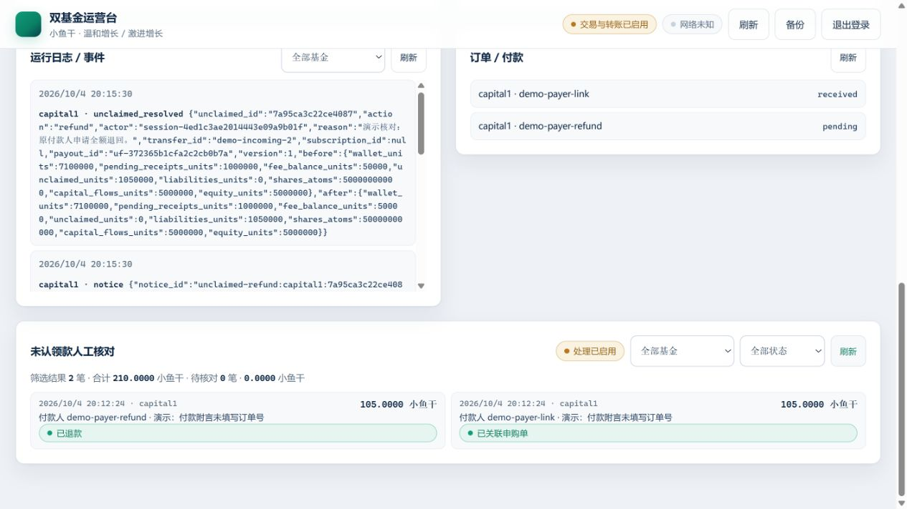

# 未认领款核对操作手册

给管理人的操作步骤。规则口径与接口见 [人工核对设计](../design/UNCLAIMED_REVIEW.md)；
运营台整体用法见 [USAGE.md](USAGE.md)。

**一句话**：未认领款是真实到账但没能自动匹配的钱，只能由人工在「原路全额退款」和
「关联已有申购单」之间选一个结果；拿不准就保持待核对，系统不会替你做决定。

## 1. 开始之前

- 面板在运营台「未认领款人工核对」区块，登录后每 5 秒自动刷新。
- 右上角徽标显示当前模式：**处理已启用** 表示外部写总闸打开；**只读预览 · 仅核对** 表示
  `live=false`，只能核对和预览，提交会被拒绝。
- 需要的是**站点权威到账记录**，不是聊天截图或用户自述。看到流水对不上时先查证再动手。

## 2. 操作步骤

1. **筛选**：选择基金与状态（全部 / 待核对 / 已关联 / 退款排队 / 退款待对账 / 已退款）。
   摘要行显示筛选结果笔数与合计，以及其中待核对笔数与合计。
   （按「已关联」或「退款排队」筛选时，待核对数字只统计当前筛选结果。）
2. **选一笔**：点击列表中的流水，下方展开详情。
3. **看详情**：逐项核对流水 ID、上游流水号、交易记录行、付款人、金额、权威到账时间、
   登记时间与**原始附言**。金额、付款人、到账时间都不能修改。
4. **看候选与历史**：候选申购单列出可关联的订单及不可关联的原因；「核对历史」显示
   以往的处理记录、理由、结果与操作会话摘要（不透明摘要，用于区分不同管理会话）。
5. **选处理方式**：
   - 关联已有申购单 —— 必须在上方候选里**选中一单**（不可关联的候选不能选）。
   - 原路全额退款 —— 只退给原付款人、只按原始金额，无需选择候选。
6. **填写理由（必填，≤500 字）**：写明核对依据，例如「与用户核对后确认附言漏填订单号，
   付款人、金额与到账时间与订单一致」。理由会写入审计记录。
7. **核对预览**：服务端会重新读取权威到账记录并给出校验结果与问题项。
   改动处理方式、候选或理由后预览即失效，需要重新预览。
8. **最终确认**：确认摘要列出处理方式、基金与流水、付款人、金额、关联订单/退款去向、
   理由与记录版本；勾选确认后点击「确认提交处理」。
9. **跟踪结果**：提交成功后看该笔流水的新状态，以及本流水详情中的退款进度。

## 3. 怎么选：退款还是关联

| 情况 | 处理 |
| --- | --- |
| 付款人、金额、基金都对，只是**附言错填/漏填**导致没匹配上 | 关联到那一张已有申购单；保留原始附言，理由写清楚 |
| 金额不符、重复付款、订单已取消/已发行/已退款、到账在订单有效期之外 | 原路全额退款，由用户重新申购 |
| 没有对应订单，或订单与到账对不上 | 原路全额退款 |
| 流水信息缺失、来源或时间无法确认、多笔之间存在歧义 | **保持待核对**，等更多证据；不要为了清空列表而处理 |

补充：

- 人工关联**只纠正匹配**，不修改到账时间、金额、手续费和付款人，也不允许管理人代建或倒签申购单。
- 关联后份额与资本流入仍由既有的月末流程发行；**不补登记已结算月份、不追溯分红**。
- 到账时间以**站点权威时间**为准。到期前已真实到账、后来才发现的付款，不能只因为发现得晚就
  判为超时（也不能因此倒签）。
- 如果处理需要改写已冻结或已结算的快照，第一版保持待核对或退款，不自动改历史账。
- 历史数据仅在同基金、付款人、金额、时间和附言唯一对应上游流水时才补齐；无法唯一确定就继续隔离。

## 4. 状态含义

| 显示 | 含义 |
| --- | --- |
| 待核对 | 尚未处理，钱仍隔离在未认领款中 |
| 已关联申购单 | 已转为待确认申购，等月末流程发行份额 |
| 退款已排队 · 尚未付款 | 已生成付款队列，**还没有实际付款** |
| 退款已排队 · 等待可用现金（…） | 现金不足（不含待确认收款、预收费用与其他未认领款），保持排队等待 |
| 退款结果待确认（未知，需先对账） | 付款结果未知：先查权威出账流水，确认为唯一匹配才结案，不会另开一笔 |
| 已退款 | 已确认退款成功 |

**排队不等于已付款**：看到「退款已排队」不要向用户承诺钱已到账，以「已退款」或站点出账记录为准。

## 5. 同时有人操作、重复点击

- 「正在核对」只是本机界面状态，不会锁住记录；另一个人可以同时打开同一笔。
- 提交时按记录版本做原子校验：只有一个人能成功，另一人会看到
  「该记录已被其他操作更新」，面板会自动重新加载详情，**必须重新核对后再提交**。
- 同一笔流水只会产生一个处理结果；预览失效后请重新预览，不要凭记忆提交。
- 页面刷新或切换筛选不会提交任何东西；填写的理由未提交前只存在于浏览器里。

## 6. 只读模式与隐私

- `live=false`：预览可用且没有任何账务副作用；提交按钮禁用，并说明「不会生成付款队列、
  不会改动账务」。预览不会保存处理结论，需打开写总闸后重新核对并提交。
- 页面不显示账号口令、Cookie 与管理令牌；请求体里没有金额、付款人和操作人身份，
  服务端从会话派生不透明审计标识。**审计能区分不同管理会话，但不能据此确认具体个人身份。**
- 退出登录会清空面板中的列表、详情、草稿与预览。

## 7. 常见问题

| 现象 | 说明 |
| --- | --- |
| 提示「处理理由必填」 | 理由为空；写清楚核对依据再预览 |
| 提示「关联处理必须先选中候选申购单」 | 没有选候选，或所有候选都不可关联；改用退款或保持待核对 |
| 提示「预览未通过」 | 条件不满足（付款人/金额/时间/订单状态等），问题项会逐条列出 |
| 提示「提交被拒绝：…（stale_version）」 | 别人刚处理过或版本已变化；重新核对后再提交 |
| 提示「提交被拒绝：…（live_required）」 | 当前是只读预览模式，需先打开外部写总闸 |
| 列表为空 | 可能没有未认领款，或筛选条件过窄；切回「全部状态」看看 |

余额读取失败时不会发送退款。付款已发出但确认失败时保留未知状态，先核对完整出账流水，
不会另建一笔退款；历史流水信息不足时仍保持待核对。

## 演示界面

以下使用虚构付款人与本地账簿，展示已关联和已退款状态，不代表真实账户收付验收。

